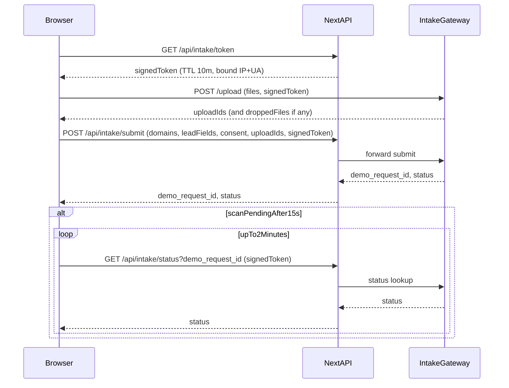

# Fusionstek Marketing Website — MVP→V1 Build Plan (Revised)

## Goals & Non-Goals

- **Primary goal**: capture qualified “Book a Demo” leads via `/demo` intake request.
- **Non-goal**: no live platform demo, no dashboard links, no direct CRM/email integration in MVP.

## Tech Stack (Chosen)

- **Framework**: Next.js (App Router) + TypeScript
- **UI**: Tailwind CSS + shadcn/ui primitives
- **Forms**: React Hook Form + Zod
- **Analytics**: Event hooks only (provider can be swapped later); no PII in event payloads

## IA / Routes (MVP)

- `/` Home
- `/how-it-works`
- `/use-cases`
- `/why-us`
- `/demo` Demo intake (primary conversion)
- `/contact` (reuse same LeadForm)

All pages share **sticky Navbar**, consistent container/section spacing, and **Footer**.

## Design System + Reusable Components (Build First)

- **Design tokens**: spacing scale, typography scale, container widths, grid spacing, responsive breakpoints (mobile 390, tablet 768, desktop 1440).
- **Reusable components** (placeholders for copy everywhere):
  - `Navbar`, `Footer`
  - `CTAButton` (primary/secondary)
  - `SectionWrapper` (title + subtitle + slot)
  - `FeatureCard`, `IconCard`
  - `StepStrip` (4-step visual)
  - `UseCaseTile`
  - `TestimonialStrip` (placeholder cards)
  - `FAQAccordion` (placeholder Q&A)
  - `LeadForm` (shared by `/demo` and `/contact`)

## Demo Intake: Functional + Security Requirements (Updated)

### Intake Fields (MVP)

- **Domains (required, multi)**:
  - User can enter **multiple domains** separated by comma or newline.
  - Normalize: trim whitespace, lowercase.
  - Dedupe: case-insensitive.
  - Limits: **max 25 domains**, max **253 chars** per domain.
  - Validate: accept FQDN-style values (no URLs); reject invalid labels.

- **Files (optional)**:
  - Allow **any file type**.
  - Limits: **max 3 files**, **max 10MB each**.

- **Consent checkbox (required)**:
  - Text: “I have authorization to assess this domain.”

- **Honeypot (required)**:
  - Hidden field; server must reject if populated.

- Other typical lead fields (exact list can be tuned, but must remain minimal + business-friendly): name/email/company + optional notes.

### Submission Destination

- **Destination**: Intake Gateway API (not email/CRM).
- **Success response** includes:
  - `demo_request_id`
  - `status`

### Malware Scanning + Retention (Backend contract, UI support)

- **Scanning**: server-side malware scanning required.
- **Retention**: uploaded files auto-deleted **90 days from submission**.

### Scan UX

- **Preferred**: synchronous scan completion before “success”.
- **Fallback**: if scan not complete within **15s**, show “processing” state with reference ID.
- **Polling after fallback**: poll scan status **up to 2 minutes** (e.g., every 5s) through Next.js proxy; if completes, update UI accordingly; if not, keep processing message and rely on email.

### Handling flagged files

- If some files are flagged, **drop only those files** but accept the request.
- Confirmation UI must show:
  - Success state with `demo_request_id`
  - Warning listing removed **filenames**
  - Reasons are **generic-only** strings (no detailed scanner output)

### Error taxonomy (MVP UX)

- UI maps errors into only:
  - **Rate limited**
  - **Other error**

(Internally we still preserve structured error detail for logs/diagnostics, but do not surface to users.)

## Anti-Spam & Security Model (Updated)

### Signed one-time token (required)

To reduce abuse and avoid exposing Intake Gateway directly:

- **Token issuance**: Next.js route issues a short-lived signed token.
- **TTL**: **10 minutes**
- **Binding**: token bound to **client IP + User-Agent hash**

### Where token is required

- **Upload**: token required
- **Final submission**: token required
- **Status polling**: token required, via Next.js proxy

### Integration pattern (MVP)

- **Hybrid recommended**:
  - **Metadata submit**: browser → Next.js `/api/intake/submit` → Intake Gateway
  - **Uploads**: browser → Intake Gateway upload endpoint (authorized via token)
  - **Status polling**: browser → Next.js `/api/intake/status` → Intake Gateway

This avoids CORS complexity for sensitive calls, keeps consistent error handling, and avoids proxying large files through Next.js.

## Analytics (MVP)

Fire events without PII payloads:

- `demo_request_submitted`
- `demo_request_success`
- `demo_request_error`
- `rate_limited`

## SEO + Performance (MVP)

- Page titles + meta descriptions placeholders
- OpenGraph/Twitter placeholders
- `sitemap.xml` + `robots.txt`
- Next.js image optimization + lazy loading where relevant
- Avoid heavy animations that block render

## Page Build Requirements

Pages should be built from modular sections with placeholder copy blocks.

### `/` Home

- Hero (primary CTA `/demo`, secondary CTA `/how-it-works`)
- Problem (3-card)
- Value/Difference (3–4 feature cards)
- How It Works preview (StepStrip + CTA)
- Use Cases preview (3 tiles + CTA)
- Proof/Trust (placeholder metrics/testimonials)
- Final CTA band (CTA `/demo`)

### `/how-it-works`

- Hero
- 4-step process (expanded StepStrip + paragraphs)
- What you get (FeatureCard grid)
- FAQ (FAQAccordion)
- CTA band

### `/use-cases`

- Hero
- 3 use-case blocks (title + description + 3 bullets)
- CTA band

### `/why-us`

- Hero
- Differentiators grid (6 cards)
- Optional comparison table (structure only)
- CTA band

### `/demo`

- Explicitly state: **intake request**, not live demo.
- LeadForm + domains + files + required consent.
- Confirmation must:
  - Say results will be emailed
  - Display `demo_request_id`
  - Not link to any platform/dashboard

### `/contact`

- Short intro + reuse LeadForm

## Key Files (Expected)

- `app/layout.tsx`, `app/page.tsx`, `app/*/page.tsx`
- `components/layout/Navbar.tsx`, `components/layout/Footer.tsx`
- `components/forms/LeadForm.tsx`
- `components/sections/*`
- `app/api/intake/token/route.ts` (issue token)
- `app/api/intake/submit/route.ts` (submit metadata)
- `app/api/intake/status/route.ts` (poll status)
- `.env.example` including:
  - `NEXT_PUBLIC_INTAKE_GATEWAY_URL`

## Data Flow (High-level)

## Open Items (Need later)

- Final Intake Gateway API contract (exact endpoints + payloads)
- Branding (logo, colors, typography preference)
- Final copy for all pages